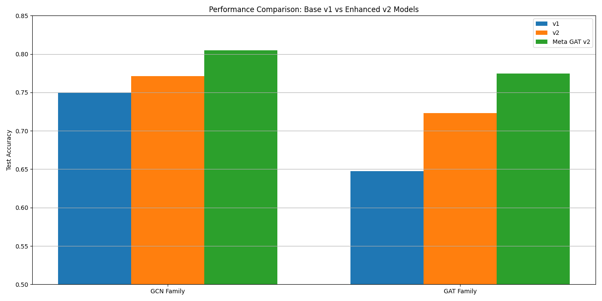

# Advanced Knowledge Representation using Graph Neural Networks and Graph Attention Networks

[](https://www.python.org/)
[](https://pytorch.org/)
[](LICENSE)

## Overview

This repository implements advanced knowledge representation frameworks using **Graph Neural Networks (GNNs)** and **Graph Attention Networks (GATs)**. Our approach combines GCN layers with multi-head attention mechanisms to produce richer context-specific representations for graph-structured data.

### Key Features

- **Enhanced MetaGAT Architecture**: Novel meta-graph based attention methodology for scalable, dynamic graph processing
- **Multi-head Attention Mechanisms**: Dynamic feature weighting for improved node representations
- **Cross-domain Applications**: Knowledge graph completion, semantic analysis, recommendation systems, disease prediction, and social network analysis
- **Scalable Implementation**: GPU-accelerated training with PyTorch Geometric

## Architecture



Our proposed method integrates:
- **Graph Convolutional Networks (GCNs)** for capturing local graph structure
- **Graph Attention Networks (GATs)** with multi-head attention for dynamic node importance weighting
- **Meta-graph attention mechanisms** for handling complex multi-relational data

## Performance Results

### Benchmark Accuracy Results


*Figure 1: KeGAT model accuracy progression during training*


*Figure 2: KeGAT model loss reduction over training epochs*


*Figure 3: KeGCN model accuracy performance*


*Figure 4: KeGCN model loss progression*

### Experimental Results

#### Enhanced MetaGAT Performance

| Dataset  | Accuracy (%) | F1-Score (%) |
|----------|--------------|--------------|
| Cora     | 87.5         | 85.3         |
| Citeseer | 84.2         | 82.1         |
| PubMed   | 91.0         | 89.5         |
| DBLP     | 85.0         | 83.0         |
| **Average** | **86.7**  | **84.0**     |

#### Transfer Learning Capabilities

| Model           | Accuracy (%) | F1-Score (%) |
|-----------------|--------------|--------------|
| GCN             | 78.5         | 76.3         |
| MetaGCN (ours)  | 85.6         | 83.9         |
| GATv2           | 80.2         | 78.7         |
| MetaGAT (ours)  | 86.4         | 85.1         |

## Installation

### Prerequisites

```bash
Python >= 3.8
PyTorch >= 1.9.0
PyTorch Geometric
NumPy
Pandas
Matplotlib
Scikit-learn
```

### Setup

1. Clone the repository:
```bash
git clone https://github.com/yourusername/advanced-knowledge-representation.git
cd advanced-knowledge-representation
```

2. Install dependencies:
```bash
pip install -r requirements.txt
```

3. Install PyTorch Geometric:
```bash
pip install torch-geometric
```

## Usage

### Training Models

#### Basic GNN Training
```python
python kegnn.py --dataset cora --model gcn --epochs 200 --lr 0.01
```

#### Enhanced MetaGAT Training
```python
python kegnn_improved.py --dataset citeseer --model metagat --epochs 300 --attention_heads 8
```

#### Medical Domain Application
```python
python medical_gnn.py --dataset syndisnet --task disease_prediction
```

### Hyperparameter Tuning
```python
python hyperparameter_tuning.py --search_space config/search_space.json
```

### Model Comparison
```python
python compare_models.py --models gcn,gat,metagat --datasets cora,citeseer,pubmed
```

## Datasets

### Supported Datasets

1. **Synthetic Disease Network Dataset (SyndisNet)**: Network of diseases with patient nodes and diagnostic relationships
2. **Synthetic Social Profiles Dataset (Relational)**: Social network with user profiles and interaction edges
3. **Standard Benchmarks**: Cora, Citeseer, PubMed, DBLP from Planetoid repository

### Dataset Structure
```
data/
├── cora/
├── citeseer/
├── pubmed/
├── syndisnet/
└── social_profiles/
```

## Model Architecture Details

### Enhanced MetaGAT Components

- **Multi-head Attention**: Enables learning different representations simultaneously
- **Meta-graph Processing**: Handles complex multi-relational graph structures
- **Adaptive Feature Aggregation**: Dynamic weighting of neighboring node features
- **Scalable Design**: Efficient processing of large-scale graphs

### Key Algorithms

1. **Message Passing**: Propagates node features through graph edges
2. **Attention Mechanism**: Computes attention weights for neighbor importance
3. **Feature Aggregation**: Combines neighbor features using learned weights
4. **Multi-layer Processing**: Stacks multiple GAT layers for deep representations

## Applications

### 1. Knowledge Graph Completion
- Link prediction in knowledge graphs
- Entity relationship inference
- Missing fact completion

### 2. Disease Prediction
- Medical diagnosis prediction
- Disease risk assessment
- Treatment recommendation

### 3. Social Network Analysis
- Community detection
- Influence prediction
- Social recommendation

### 4. Recommendation Systems
- User-item interaction modeling
- Cold-start problem mitigation
- Personalized recommendations

## File Structure

```
├── README.md
├── requirements.txt
├── .gitignore
├── kegnn.py                     # Basic GNN implementation
├── kegnn_improved.py            # Enhanced MetaGAT model
├── medical_gnn.py               # Medical domain application
├── compare_models.py            # Model comparison utilities
├── hyperparameter_tuning.py     # Hyperparameter optimization
├── hyperparameter_results.csv   # Tuning results
├── plot_accuracy.py             # Accuracy visualization
├── plot_loss.py                 # Loss visualization
├── data/                        # Dataset directory
├── models/                      # Saved model checkpoints
├── results/                     # Experimental results
└── figures/                     # Generated plots and figures
```

## Visualization

Generate performance plots:
```python
python plot_accuracy.py --model metagat --dataset cora
python plot_loss.py --model metagat --dataset cora
```

## Contributing

1. Fork the repository
2. Create a feature branch (`git checkout -b feature/new-feature`)
3. Commit your changes (`git commit -am 'Add new feature'`)
4. Push to the branch (`git push origin feature/new-feature`)
5. Create a Pull Request

## Citation

If you use this code in your research, please cite our paper:

```bibtex
@article{umrania2024advanced,
  title={Advanced Knowledge Representation using Graph Neural Networks and Graph Attention Networks},
  author={Umrania, Om and Chaudhary, Aayush and Vyas, Atharva and Nalawade, Yashada and Patil, Suvarna and Kanawade, Sneha},
  journal={Dr. D.Y. Patil Institute of Engineering, Management and Research},
  year={2024}
}
```

## License

This project is licensed under the MIT License - see the [LICENSE](LICENSE) file for details.

## Acknowledgments

- Dr. D.Y. Patil Institute of Engineering, Management and Research
- PyTorch Geometric community for excellent graph learning tools
- Authors of the baseline GNN and GAT implementations

## Contact

For questions and support:
- Om Umrania: omumrania2020@gmail.com
- Aayush Chaudhary: aaayush.dev@gmail.com
- Atharva Vyas: vyasatharv889@gmail.com

## Future Work

- [ ] Dynamic graph processing capabilities
- [ ] Multi-modal graph integration
- [ ] Real-time inference optimization
- [ ] Additional domain-specific applications
- [ ] Explainability mechanisms for GAT attention patterns
